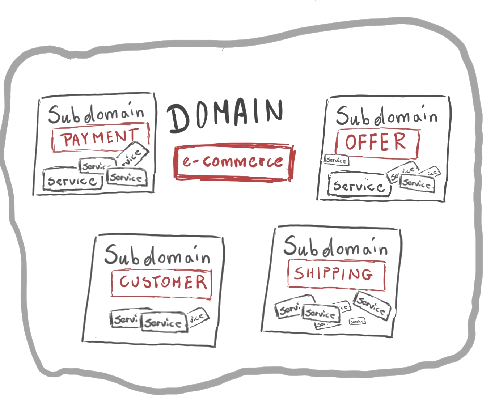

+++

title = "Domain Driven Design"
description = "Practical introduction to Domain Driven Design"
outputs = ["Reveal"]

[reveal_hugo.custom_theme_options]
targetPath = "css/custom-theme.css"
enableSourceMap = true

+++

# Domain Driven Design  

## 

 

### [Giovanni Ciatto --- `giovanni.ciatto@unibo.it`](mailto:giovanni.ciatto@unibo.it)

 

Compiled on:  --- [<i class="fa fa-print" aria-hidden="true"></i> printable version](?print-pdf&pdfSeparateFragments=false)

[<i class="fa fa-undo" aria-hidden="true"></i> back](..)

---

# Motivation and Context

---

## Why a structured design process?

- You know programming, in many programming languages

- You know about object-oriented programming and design patterns

- You know about software architectures and design principles

- You know about software engineering best practices

 

*What's the __criterion__ to choose __if__ and __when__ to adopt languages / patterns / architectures / principles / practices?*

---

## Recommended workflow

### Problem $\xrightarrow{\color{red}analysis}$ **Model** $\xrightarrow{\color{red}design}$ Architecture $\xrightarrow{implementation}$ Solution

- yet, how to derive the model?

---

## Why Domain Driven Design?

- Here we present __domain-driven design__ (DDD)
    + one of many approaches to software design

- It consists of principles, best practices, and patterns leading design
    + unified under a common _philosophy_
    + focus is on the _design workflow_, other than the result

- We prefer it over alternatives for several reasons:
    + it stresses _adherence_ to the problem at hand
    + it focuses on delivering a _business-tailored_ model
        * and, therefore, a business-tailored solution
    + it harmonises _communication_ among managers, technicians, and users
    + it stresses the production of maintanable and _extensible_ software

---

# About Domain-Driven Design

---

{}

## What is the domain?

- Definition of __domain__:
    + a well established sphere of knowledge, influence or activity
    + the subject area to which the user applies the software

- Remarks:
    + focus is on how users and experts perceive the domain
    + focus is not on how developers perceive the domain

- Examples of domains and the contexts composing them
    + some university (department, faculty, HR, etc.)
    + some given company (manufacturing, marketing, HR, etc.)
    + linear algebra (matrices, complex numbers, polynoms, etc.)
    + machine learning (classification, regression, feature selection, etc.)

---

## DDD Philosophy (pt. 1)

- Software will represent a solution to a problem in some business domain
    + it should be modelled & implemented to match that domain
        * i.e. modelling should elicit the key aspects of a domain, possibly by interacting with experts

- Words do not have meaning per se, but rather w.r.t. a domain
    + i.e. the same word may have different meanings in different domains
    + each domain comes with a particular language characterising it
        * SW components (interfaces, classes, etc.) should be named after that language
    + interaction with experts is essential to identify a domain’s language

---

## DDD Philosophy (pt. 2)

- SW should stick to the domain, at any moment
    + archiecture and implementation should favour adherence to the domain
        * in spite of their evolution / modification

- Functionalities, structure, and UX should mirror the domain too
    - using the libraries should be natural for developers
    - UX should be natural for users

    as both developers and users are (supposed to be) immersed in the domain

{}

---

{}

## Main notions (overview)

- __Domain__: the reference area of knowledge

- __Context__: a portion of the domain

- __Model__: a reification of the domain in SW

- __Ubiquitous Language__: language used by domain experts and mirrored by the model

---

## Main notions (_Domain_)

> A well established sphere of knowledge, influence or activity

- e.g. some university (department, faculty, HR, etc.), linear algebra, etc.

---

## Main notions (_Context_)

> A portion of the domain:
> - relying on a sub-set of the concepts of the domain
> - where words/names have a unique, precise meaning

- e.g. departments, divisions, complex numbers, etc.

--- 

## Main notions (Domain _vs._ Context)

---

## Main notions (Domain _Model_)

> Set of __software__ abstractions mapping relevant _concepts_ of the domain

- e.g. C# projects, namespaces, interfaces, classes, structures, methods, etc.

---

## Main notions (_Ubiquitous Language_)

> - A _language_ structured around the domain model
>   + _used by all people_ involved into the domain
>   + which should be _used in the software_
>   + in such a way that their _semantics is preserved_

- underlying assumption:
    * different people call the same things differently
    * especially when they come from different contexts

- commonly reified into a __glossary__ of terms

- commonly used to name software components

{}

---

## Conceptual Workflow

1. Identify the domain

2. Identify the main contexts within the domain
    -  possibly, by interacting with experts

3. Identify the actual meaning of commonly used words within the domain
    - possibly, by interacting with experts
    
    - _without assuming you already know the meaning of words_
        + i.e. do __not__ rely on (your) __common sense__

    - keep in mind that the meaning of word may vary among contexts
        + this is not just a glossary, but also
            * idiomatic or domain-specific expressions
            * procedures, events, etc.

4. Adhere to the language, use it, make it yours
    - especially when talking about the domain / model / software
    - design/sketch code mirroring the language

5. Draw a __context map__ tracking
    - the main contexts and their junctions
    - words whose meaning varies across contexts

6. Model the software around the ubiquitous language
    - rule of thumb: __1 concept $\approx$ 1 interface__

---

